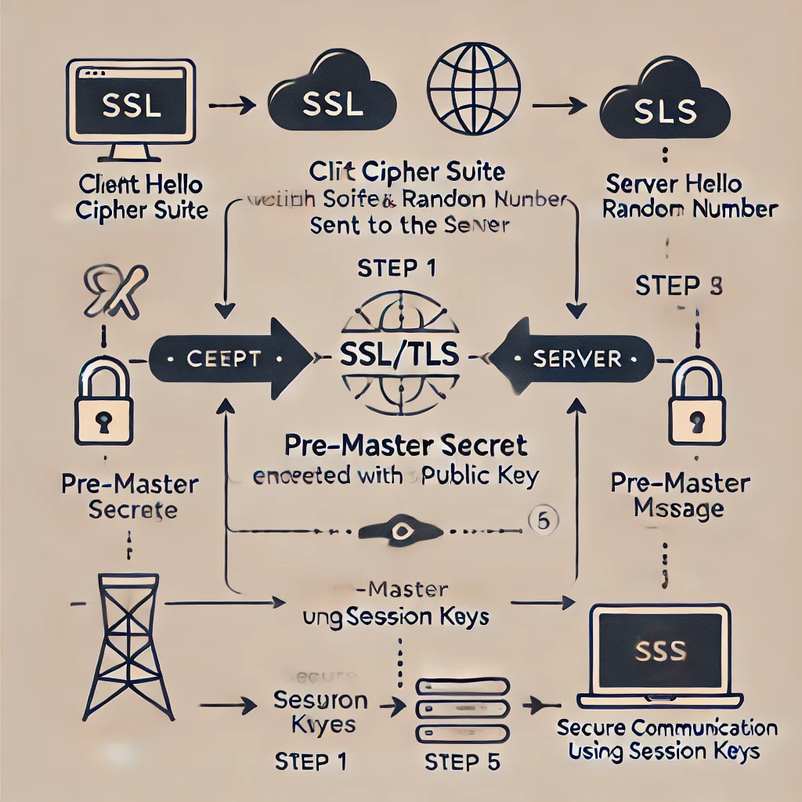

# SSL/TLS Handshake Overview

## Introduction
The **SSL (Secure Sockets Layer)** and **TLS (Transport Layer Security)** protocols are used to establish secure communication over a network. They help protect data integrity, confidentiality, and authentication between a client (browser) and a server (website). The SSL/TLS handshake is the process through which a secure session is established between these entities.

---

## SSL/TLS Handshake Process

The SSL/TLS handshake consists of several key steps that ensure both the client and server agree on encryption methods, verify identities, and securely exchange keys for encrypted communication.

### Steps:

1. **Client Hello**  
   - The client initiates the communication by sending a "Hello" message, which includes:
     - Supported encryption algorithms (cipher suites)
     - A randomly generated number (client random)
     - The SSL/TLS version the client supports

2. **Server Hello**
   - The server responds with its own "Hello" message, which includes:
     - The selected cipher suite (from the client’s preferences)
     - The server’s SSL/TLS certificate containing its public key
     - A randomly generated number (server random)

3. **Server Certificate Verification**
   - The client verifies the server’s certificate using a trusted Certificate Authority (CA). If the certificate is valid, the handshake continues.

4. **Pre-Master Secret**
   - The client generates a **pre-master secret**, encrypts it with the server’s public key, and sends it to the server.

5. **Session Key Generation**
   - Both the client and server generate identical session keys based on the client random, server random, and pre-master secret. These symmetric keys are used for encryption and decryption.

6. **Client Finished**
   - The client sends a "Finished" message, encrypted with the session key, to indicate that it has completed the handshake.

7. **Server Finished**
   - The server responds with its own "Finished" message, also encrypted, to confirm that secure communication can begin.

8. **Secure Communication**
   - From this point onward, the client and server communicate securely using the session keys for encryption and decryption.

---

## SSL/TLS Handshake Diagram

Below is a visual representation of the SSL/TLS handshake process:

The diagram illustrates the following key steps:
- Client Hello
- Server Hello
- Server Certificate Verification
- Pre-Master Secret Exchange
- Session Key Derivation
- Finished Messages
- Secure Communication

---

## Conclusion
The SSL/TLS handshake ensures that a secure and encrypted connection is established between a client and server. By following this multi-step process, both parties can safely exchange information without the risk of eavesdropping or tampering.

